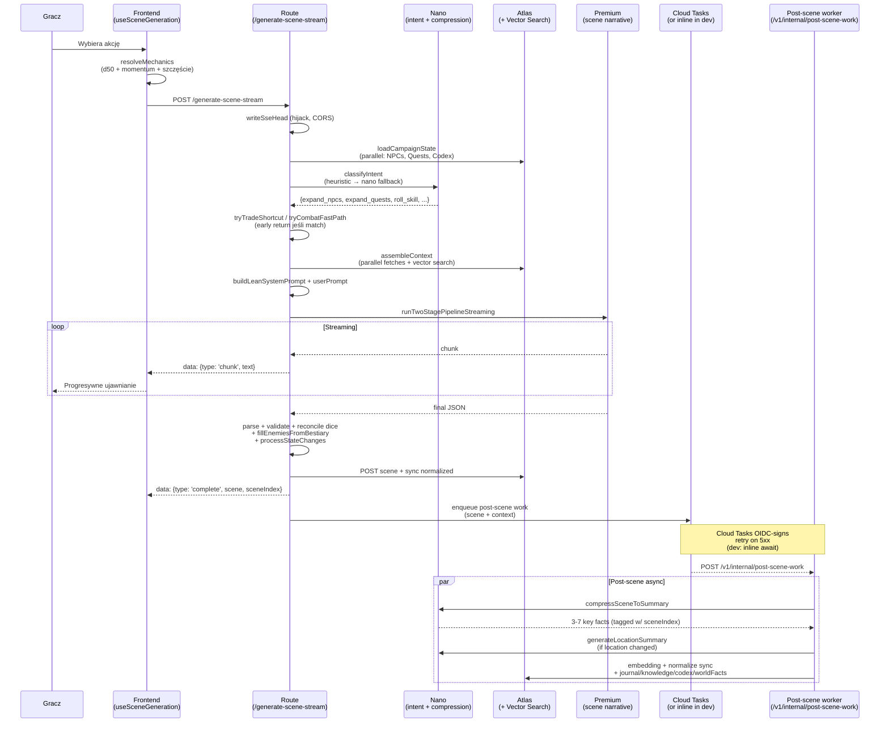
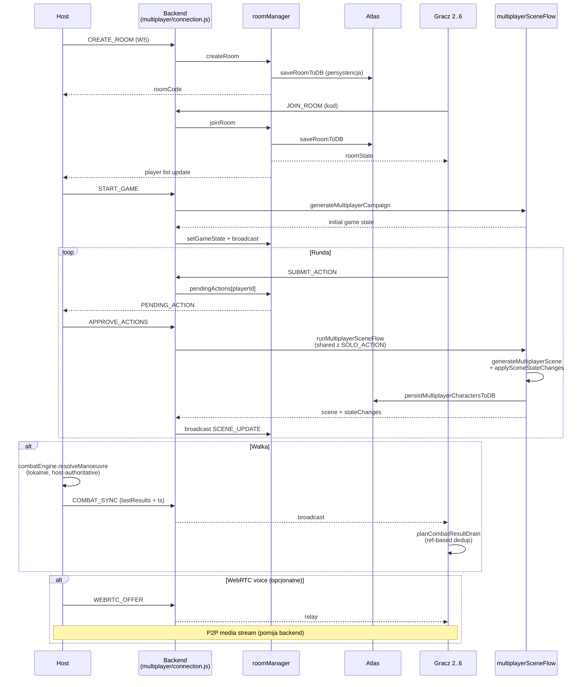

# RPGon — AI-Narrated Tabletop RPG

> **[English](#english)** | **[Polski](#polski)**

---

<a id="english"></a>

## English

RPGon (in-game: **Nikczemny Krzemuch**) is a browser-based tabletop RPG with an AI Game Master running on a **custom d50 system**. A multi-model LLM pipeline narrates the story, resolves mechanics, manages quests and a living world — in solo mode or multiplayer with up to 6 players.

### Key Features

- **AI Dungeon Master** — two-stage pipeline: nano model picks what context the scene needs, code assembles it in parallel, premium model writes the scene in one streamed call
- **RPGon d50 system** — custom rules designed for AI-GM play: 6 attributes (1-25), ~31 skills, 9 spell trees with mana-based magic, d50 resolution with margins, `szczęście` as auto-success chance, titles from achievements (no classes), three-tier Polish currency (Złota/Srebrna/Miedziana Korona)
- **Multi-provider AI** — OpenAI (GPT-5.4 / 4.1 / 4o / o3 / o4), Anthropic (Claude Sonnet 4, Haiku 4.5), Google Gemini, with nano/standard/premium tiering to keep costs bounded
- **Streaming UX** — scenes stream narrative chunks via SSE directly from the backend route; post-scene async work (embeddings, memory compression, location summary) is dispatched to Cloud Tasks (prod) or runs inline (dev)
- **Multiplayer** — up to 6 players via WebSocket, host-authoritative state, mid-game join, solo → multiplayer conversion, optional WebRTC voice chat
- **3D scene rendering** — React Three Fiber with procedural foliage, GLB models, ambient weather/particle effects
- **Rich media** — AI-generated scene illustrations (Stability AI), voice narrator (ElevenLabs TTS with word highlighting), on-demand 3D model generation (Meshy)
- **Living world** — NPCs with dispositions, faction reputation, weather + day/night, needs system (hunger, fatigue), vector-searchable campaign memory
- **Public gallery** — publish campaigns for others to browse and fork
- **Bilingual** — Polish (default) and English UI

### Quick Start

```bash
npm run setup                          # root + backend deps, prisma generate
cp backend/.env.example backend/.env   # fill in JWT_SECRET, API_KEY_ENCRYPTION_SECRET, AI keys
npm run dev                            # docker compose up --build --watch (db + backend :3001)
cd backend && npm run db:migrate       # apply Prisma migrations to the local Postgres
```

**Database** is Postgres 16 + pgvector, bundled as the `db` service in `docker-compose.yml`. `DATABASE_URL` defaults to `postgresql://rpgon:rpgon@db:5432/rpgon` for compose and `localhost:5432` for host-machine runs — no `.env` editing required for offline dev. The backend is the sole AI dispatch path; users can paste their own provider keys in Settings which are stored encrypted server-side.

HNSW vector indexes ship inside the init migration — there is no separate setup script.

### Documentation

- **[CLAUDE.md](./CLAUDE.md)** — terse top-level guide (stack, commands, architecture, critical-path files)
- **[knowledge/](./knowledge/)** — detailed subsystem docs
  - [concepts/](./knowledge/concepts/) — how each subsystem works
  - [patterns/](./knowledge/patterns/) — reusable code patterns
  - [decisions/](./knowledge/decisions/) — why we picked option B over A/C
  - [ideas/](./knowledge/ideas/) — future concepts not yet built
- **[RPG_SYSTEM.md](./RPG_SYSTEM.md)** — full RPGon rules specification

---

<a id="polski"></a>

## Polski

RPGon to przeglądarkowa gra RPG z narratorem AI, zbudowana na **autorskim systemie d50** (RPGon). Pipeline wielomodelowy prowadzi fabułę, rozstrzyga mechaniki, zarządza questami i żywym światem — w trybie solo lub multiplayer do 6 graczy.

### Spis treści

- [Architektura](#architektura)
- [Przepływ gry](#przepływ-gry)
- [Pipeline AI (dwuetapowy)](#pipeline-ai-dwuetapowy)
- [Multiplayer](#multiplayer)
- [System RPGon](#system-rpgon)
- [Funkcjonalności](#funkcjonalności)
- [Stos technologiczny](#stos-technologiczny)
- [Struktura projektu](#struktura-projektu)
- [Uruchomienie](#uruchomienie)
- [Dokumentacja](#dokumentacja)

---

## Architektura

Backend jest jedyną ścieżką dispatcha AI — frontend nie rozmawia bezpośrednio z providerami. Scena streamuje się bezpośrednio z route'a (Fastify SSE), a post-scene work (embedding, kompresja pamięci, podsumowania) jedzie przez Cloud Tasks (prod) albo inline fire-and-forget (dev). Bez Redisa — refresh tokeny w Postgresie (cleanup co 10 min via `setInterval`), rate-limit + idempotency in-memory per-instance.

```mermaid
graph TB
    subgraph Frontend ["Frontend — React + Vite"]
        UI[Panele gameplay<br/>Scene/Chat/Combat/Action]
        ZS[Zustand store<br/>gameStore + handlers]
        SEL[Granularne selektory]
        SCN[useSceneGeneration<br/>+ sceneGeneration/]
        HOOKS[Combat hooks<br/>4 pure-factory + test]
        API[apiClient.js<br/>JWT + refresh + CSRF]
        WS_C[websocket.js<br/>multiplayer client]
    end

    subgraph Backend ["Backend — Fastify (Cloud Run)"]
        ROUTE_AI[/v1/ai/*<br/>SSE + single-shot]
        ROUTE_MP[/v1/multiplayer<br/>WebSocket]
        ROUTE_AUTH[/v1/auth<br/>cookie refresh + CSRF]
        ROUTE_CAMP[/v1/campaigns<br/>CRUD + share + recaps]
        ROUTE_POST[/v1/internal/<br/>post-scene-work<br/>+ OIDC verify]
        SCENE_GEN[sceneGenerator/<br/>generateSceneStream]
        INTENT[intentClassifier<br/>heuristic + nano]
        CTX[aiContextTools<br/>assembleContext]
        COMP[memoryCompressor<br/>nano facts + summaries]
        POST[postSceneWork<br/>embedding + sync + compress]
        MP_FLOW[multiplayerSceneFlow<br/>+ multiplayerAI/]
        ROOM[roomManager<br/>in-memory + DB backup]
    end

    subgraph Async ["Post-scene dispatch"]
        CT[Cloud Tasks queue<br/>prod: OIDC-signed POST<br/>dev: inline fire-and-forget]
    end

    subgraph Providers ["Providers"]
        OPENAI[OpenAI<br/>GPT-5.4/4.1/4o/o3]
        ANTHROPIC[Anthropic<br/>Claude Sonnet 4 + Haiku 4.5]
        GEMINI[Google Gemini]
        STABILITY[Stability AI<br/>obrazy scen]
        ELEVEN[ElevenLabs<br/>TTS]
        MESHY[Meshy<br/>modele 3D]
    end

    subgraph Storage ["MongoDB Atlas"]
        ATLAS[(MongoDB Atlas<br/>Prisma: User, Campaign,<br/>Scene, NPC, Quest,<br/>Knowledge, Codex, RefreshToken)]
        VECTOR[(Atlas Vector Search<br/>embeddings via<br/>native driver)]
    end

    UI --> ZS
    ZS --> SEL
    SEL --> UI
    UI --> SCN
    SCN --> HOOKS
    SCN --> API

    API --> ROUTE_AI
    API --> ROUTE_AUTH
    API --> ROUTE_CAMP
    WS_C <-->|WebSocket| ROUTE_MP

    ROUTE_AI --> SCENE_GEN
    SCENE_GEN -->|SSE chunks| ROUTE_AI
    ROUTE_AI -.->|SSE stream| API

    SCENE_GEN --> INTENT
    SCENE_GEN --> CTX
    SCENE_GEN -->|enqueue| CT
    CT -.->|OIDC POST| ROUTE_POST
    ROUTE_POST --> POST
    POST --> COMP
    POST --> ATLAS
    POST --> VECTOR

    SCENE_GEN --> OPENAI
    SCENE_GEN --> ANTHROPIC

    ROUTE_MP --> ROOM
    ROOM --> MP_FLOW
    MP_FLOW --> OPENAI
    MP_FLOW --> ANTHROPIC

    INTENT --> OPENAI
    INTENT --> ANTHROPIC
    CTX --> ATLAS
    CTX --> VECTOR
    COMP --> ATLAS

    ROUTE_AUTH --> ATLAS
    ROUTE_CAMP --> ATLAS

    ROUTE_AI -.->|proxy| ELEVEN
    ROUTE_AI -.->|proxy| STABILITY
    ROUTE_AI -.->|proxy| MESHY
    ROUTE_AI -.->|proxy| GEMINI
```

---

## Przepływ gry


---

## Pipeline AI (dwuetapowy)

Zamiast wypychać cały stan kampanii do każdego zapytania ani wymagać żeby duży model wywoływał tools w pętli, używamy dwóch etapów: **nano wybiera**, **kod składa**, **premium narracja**.



### Co zawiera odpowiedź AI

| Pole | Opis |
|---|---|
| `narrative` | Tekst narracji opisujący scenę |
| `dialogueSegments` | Segmenty dialogu z przypisanymi postaciami (do TTS + chat) |
| `suggestedActions` | Sugerowane akcje do wyboru |
| `stateChanges` | Zmiany stanu: questy, fakty o świecie, NPC, ekwipunek, rany, pieniądze, XP umiejętności |
| `diceRolls` | Max 3 rzuty d50 z pre-rolled pool (fallback gdy nano przeoczył test) |
| `combatUpdate` | `enemyHints`, `budget`, `maxDifficulty` — backend dobiera statystyki z bestiariusza |
| `scenePacing`, `atmosphere` | Metadane do muzyki / efektów wizualnych |

### Model tiering

5 tierów. Reasoning na async, non-reasoning na ścieżce krytycznej. Szczegóły w [knowledge/concepts/model-tiering.md](./knowledge/concepts/model-tiering.md).

| Tier | OpenAI default | Anthropic default | Używany do |
|---|---|---|---|
| **nano** | gpt-4.1-nano | claude-haiku-4-5 | Klasyfikacja intencji, quest check, skill-check inference — **ścieżka krytyczna** |
| **nanoReasoning** | gpt-5.4-nano | claude-haiku-4-5 | Memory compression, location summary — **async post-scene**, reasoning pomaga |
| **standard** | gpt-4.1-mini | claude-haiku-4-5 | Combat fast-path narrative, recapy, story prompts, weryfikacja celów |
| **premium** | gpt-4.1 | claude-sonnet-4 | Generowanie scen, tworzenie kampanii — kreatywne pisanie + streaming JSON |
| **premiumReasoning** | gpt-5.4 | claude-sonnet-4 | Zarejestrowany pod A/B, domyślnie nieroutowany. Przełącz przez `AI_MODEL_PREMIUM_OPENAI` albo FE picker |

Dlaczego premium to 4.1, nie 5.4: dwuetapowy pipeline offloaduje całe myślenie do nano + deterministycznego kodu. Premium tylko pisze prozę i streamuje JSON — reasoning tokens dokładają latencji i influją dialogi bez zysku narracyjnego.

### Typy zapytań AI

- **`generateCampaign`** — fundament kampanii (SSE stream bezpośrednio z route)
- **`generateSceneStream`** — główna pętla (SSE stream bezpośrednio z route; post-scene przez Cloud Tasks)
- **`generateStoryPrompt`** — nano-model premise generator
- **`generateRecap`** — podsumowanie kampanii (chunking 25 scen/chunk)
- **`combatCommentary`** — śródwalkowa narracja i battle cries
- **`verifyObjective`** — klasyfikator spełnienia celu questa (on-demand z UI, nie per scene)

---

## Multiplayer

**Host-authoritative state** — kanoniczny stan gry żyje w przeglądarce hosta; backend jest warstwą relay + persystencji na wypadek crashu, nie silnikiem gry.



### Cykl życia pokoju

1. Host tworzy pokój lub konwertuje kampanię solo (`CONVERT_TO_MULTIPLAYER`)
2. Gracze dołączają po kodzie — lobby aktualizuje się w czasie rzeczywistym
3. Nowy gracz może dołączyć w trakcie gry — host widzi PENDING_ACTION i zatwierdza
4. Akcje graczy wymagają zatwierdzenia hosta (`APPROVE_ACTIONS`) albo są wykonywane solo (`SOLO_ACTION`) — oba path'y przechodzą przez ten sam `runMultiplayerSceneFlow`
5. Stan pokoju jest zapisywany do DB przy każdej istotnej mutacji — przeżywa czysty restart backendu (`loadActiveSessionsFromDB` na boot)
6. Pokoje bez aktywności są automatycznie czyszczone po TTL
7. **Host migration nie jest zaimplementowana** — rozłączenie hosta w trakcie walki zamraża stan do jego powrotu

---

## System RPGon

Autorski system d50 zaprojektowany pod AI-GM. Pełna specyfikacja w [RPG_SYSTEM.md](./RPG_SYSTEM.md), pointer do kodu w [knowledge/concepts/rpgon-mechanics.md](./knowledge/concepts/rpgon-mechanics.md).

### Podstawy

- **Kości:** d50 vs `atrybut + umiejętność + modyfikatory`. Rzut 1 = sukces krytyczny, rzut 50 = fiasko krytyczne.
- **Atrybuty (1-25):** `siła`, `inteligencja`, `charyzma`, `zręczność`, `wytrzymałość`, `szczęście`. Baseline — wszystkie na 1 oprócz szczęścia (0).
- **Umiejętności:** ~31 umiejętności, każda powiązana z jednym atrybutem, poziomy 0-25. **Learn-by-doing XP** — umiejętności rosną od używania, bez trenera.
- **Magia:** 9 drzewek zaklęć, system many (bez testu rzucania), zaklęcia ze zwojów, koszt 1-5 many na zaklęcie.
- **Walka:** `obrażenia = Siła + broń - Wytrzymałość - AP`. Margines sukcesu zamiast SL.
- **Szczęście = X%** automatycznego sukcesu na dowolnym rzucie. Wartość atrybutu **jest** szansą na auto-sukces.
- **Waluta:** trójpoziomowa Korona — Złota / Srebrna / Miedziana. `1 ZK = 20 SK = 240 MK`, `1 SK = 12 MK`.
- **Tożsamość postaci:** tytuły odblokowywane z osiągnięć. Brak klas / karier.

Czego **nie ma** w przeciwieństwie do WFRP: kariery, talenty, punkty losu/fortuny, odporność/determinacja, tabela ran krytycznych, channelling, advantage.

### Pre-rolled dice fallback

Nano klasyfikator intencji przeoczy ~20% akcji wymagających testów umiejętności. Backend generuje 3 wstępnie rzucone d50 na każdą scenę — duży model może użyć ich do self-resolve testów, a backend rekoncyliuje wynik z regułami mechanicznymi. Max 3 rzuty na scenę; thresholdy trudności: easy=20, medium=35, hard=50, veryHard=65, extreme=80.

---

## Funkcjonalności

### Rozgrywka
- Narracja AI (OpenAI / Anthropic / Gemini z tieringiem)
- System d50 z marginesem sukcesu i momentum
- Questy z celami, śledzenie postępu, weryfikacja przez nano
- Bestiariusz RPGon (36 jednostek, 11 ras) z budżetem spotkań i fast-path walk dla trywialnych encounterów
- Mapa świata z NPC, fakcjami, dyspozycjami
- Pole bitwy w 3D (React Three Fiber) z proceduralną flora + modelami GLB
- System potrzeb postaci (głód, zmęczenie)
- Ilustracje scen (Stability AI via proxy)
- Narrator głosowy (ElevenLabs TTS z podświetlaniem słów)
- Modele 3D generowane na żądanie (Meshy)
- Efekty wizualne (pogoda, cząsteczki, przejścia)

### Postać (RPGon)
- 6 atrybutów (1-25): siła, inteligencja, charyzma, zręczność, wytrzymałość, szczęście
- ~31 umiejętności z learn-by-doing XP
- 9 drzewek zaklęć, mana, zwoje
- Ekwipunek z rarity modifierami (common / uncommon / rare / exotic)
- Waluta ZK/SK/MK
- Charakter level w stylu Oblivion (akumulowany z poziomów umiejętności)
- Tytuły z osiągnięć
- Blokada postaci do jednej aktywnej kampanii naraz (release przy safe-location)

### Multiplayer
- Do 6 graczy w pokoju przez WebSocket
- Host-authoritative state z persystencją pokoju do DB (crash recovery)
- System zatwierdzania akcji przez hosta
- Dołączanie w trakcie rozgrywki
- Konwersja kampanii solo → multiplayer
- Akcje solo z cooldownem
- Opcjonalny czat głosowy WebRTC (peer-to-peer)

### Infra
- Per-user szyfrowane klucze API (AES-256 na serwerze)
- Cookie-based refresh tokens (15min access JWT, 30d refresh w MongoDB + TTL index)
- Double-submit CSRF
- Per-instance rate limiting (in-memory — nadaje się do Cloud Run bo ruch per-user jest mały)
- Idempotency keys na krytycznych endpointach (POST /campaigns, /scenes, /scenes/bulk) — in-memory
- Cloud Tasks do post-scene async (embedding, memory compression, location summary) z OIDC-signed callback; inline fire-and-forget w dev
- LLM timeouts tunowalne w DM Settings (domyślnie 45s premium / 15s nano)
- Zero zewnętrznych zależności runtime poza Atlas + providerami AI — idealne pod Cloud Run (scale-to-zero)

### Zarządzanie
- Zapis/wczytywanie kampanii (auto-save queue + idempotency)
- Normalizowany schemat MongoDB (Scene, NPC, Quest, Knowledge, Codex) z Atlas Vector Search
- Eksport logów rozgrywki do markdown
- Ustawienia Mistrza Gry (styl narracji, grittiness, humor, dramat, tempo, częstotliwość testów)
- Śledzenie kosztów API per model
- Publiczna galeria kampanii z fork-to-play
- Dwujęzyczność: polski (domyślny) i angielski

---

## Stos technologiczny

| Warstwa | Technologie |
|---|---|
| **Frontend** | React 18, Vite 6, React Router 6, Tailwind CSS 3, Zustand 5 + Immer, Zod 4, i18next |
| **3D** | Three.js, React Three Fiber, @react-three/drei |
| **Backend** | Fastify 5, Prisma (MongoDB), WebSocket (ws) |
| **Baza danych** | MongoDB Atlas (replica set + Atlas Vector Search) |
| **Async post-scene** | Google Cloud Tasks (prod) lub inline fire-and-forget (dev) — brak Redis/BullMQ |
| **Hosting** | Google Cloud Run (native, scale-to-zero) |
| **AI** | OpenAI (GPT-5.4 / 4.1 / 4o / o3 / o4), Anthropic (Claude Sonnet 4, Haiku 4.5), Google Gemini |
| **Media** | Sharp (image resize), ElevenLabs (TTS), Stability AI (obrazy), Meshy (modele 3D) |
| **Przechowywanie mediów** | Local filesystem lub Google Cloud Storage |
| **Auth** | JWT (15min access) + opaque refresh tokens w MongoDB (TTL index), double-submit CSRF |
| **Testing** | Vitest (unit), Playwright (e2e) |

---

## Struktura projektu

```
rage-player-game/
├── src/                                # Frontend
│   ├── App.jsx                         # Routing (/, /create, /play/:id, /join/:code, /view/:token)
│   ├── main.jsx                        # Providery (Settings, Multiplayer, Music, Modal)
│   ├── stores/                         # Zustand store
│   │   ├── gameStore.js                # Store + autoSave + getGameState + gameDispatch
│   │   ├── gameReducer.js              # Thin dispatcher merging handler maps
│   │   ├── gameSelectors.js            # Granularne selektory
│   │   └── handlers/                   # Per-domain action handlers (Immer)
│   ├── contexts/                       # SettingsContext, MultiplayerContext (+ slices), Music, Modal
│   ├── hooks/
│   │   ├── sceneGeneration/            # useSceneGeneration + backend stream + dialogue repair
│   │   ├── useCombatResolution.js      # + useEnemyTurnResolver, useCombatResultSync, useCombatHostResolve
│   │   └── useNarrator / useSummary / useImageRepairQueue / useViewerMode / ...
│   ├── services/
│   │   ├── ai/                         # service.js + models.js (backend dispatch)
│   │   ├── aiResponse/                 # Zod schemas + parser + dialogue repair
│   │   ├── mechanics/                  # d50Test, skillCheck, momentumTracker, dispositionBonus, restRecovery
│   │   ├── combatEngine.js             # Tactical combat
│   │   ├── magicEngine.js              # Mana-based spellcasting
│   │   ├── stateValidator.js           # AI state-change validation (+ shared/domain helpers)
│   │   ├── storage.js                  # Campaign save/load/queue
│   │   ├── apiClient.js                # JWT + refresh + CSRF + idempotency
│   │   └── fieldMap/                   # A* pathfinding + tile rules + chunk generator
│   ├── components/
│   │   ├── gameplay/                   # GameplayPage + ScenePanel/ChatPanel/CombatPanel/ActionPanel/...
│   │   │   ├── chat/                   # ChatMessageParts, ChatMessages, DiceRollMessage
│   │   │   ├── combat/                 # Combat UI sub-components
│   │   │   ├── scene/                  # OverlayDiceCard, HighlightedNarrative
│   │   │   └── Scene3D/                # Environment3D, Character3D, GLBModel, ProceduralFoliage, ...
│   │   ├── character/                  # CharacterSheet, Library, Advancement, Inventory, Quests, Codex
│   │   ├── creator/                    # Campaign creation wizard
│   │   ├── lobby/, gallery/, viewer/   # Lobby, public gallery, shared-campaign viewer
│   │   ├── multiplayer/                # Lobby, JoinRoomPage, PendingActions
│   │   ├── settings/sections/          # DM settings split into focused sections
│   │   ├── layout/                     # Header, Sidebar, Layout, MobileNav
│   │   └── ui/                         # Button, GlassCard, Slider, Toggle, ...
│   ├── data/                           # rpgSystem.js, rpgMagic.js, rpgFactions.js, achievements.js, prefabs.js
│   ├── effects/                        # EffectEngine, DiceRoller, biomeResolver
│   ├── utils/                          # rpgTranslate, ids, retry
│   └── locales/                        # en.json, pl.json
│
├── backend/                            # Backend
│   ├── prisma/schema.prisma            # User, Campaign, CampaignScene/NPC/Knowledge/Codex/Quest, Character, ...
│   └── src/
│       ├── server.js                   # Fastify boot, plugin registration, graceful shutdown
│       ├── config.js                   # Env config (single source)
│       ├── routes/
│       │   ├── auth.js                 # /v1/auth/* (register, login, refresh, logout, settings, api-keys)
│       │   ├── ai.js                   # /v1/ai/* (scene SSE + campaign SSE + single-shots + jobs)
│       │   ├── campaigns.js            # Facade → campaigns/{public,crud,sharing,recaps,schemas}.js
│       │   ├── multiplayer.js          # Facade → multiplayer/{http,connection,handlers/*}.js
│       │   ├── characters.js, gameData.js, media.js, music.js, wanted3d.js
│       │   └── proxy/                  # openai, anthropic, gemini, elevenlabs, stability, meshy
│       ├── services/
│       │   ├── sceneGenerator/         # generateSceneStream + phases (systemPrompt, streamingClient, shortcuts)
│       │   ├── multiplayerAI/          # aiClient, sceneGeneration, campaignGeneration
│       │   ├── intentClassifier.js     # Stage 1 — heuristic + nano
│       │   ├── aiContextTools.js       # Stage 2 — assembleContext
│       │   ├── memoryCompressor.js     # Post-scene nano summaries + quest checks (reasoning tier)
│       │   ├── aiJsonCall.js           # Shared single-shot JSON helper
│       │   ├── cloudTasks.js           # Enqueue post-scene work (prod) / inline (dev)
│       │   ├── postSceneWork.js        # Cloud Tasks handler — embedding + compress + sync
│       │   ├── oidcVerify.js           # Google OIDC token verification for Cloud Tasks callback
│       │   ├── combatCommentary.js, objectiveVerifier.js, recapGenerator.js, storyPromptGenerator.js
│       │   ├── campaignGenerator.js    # Streaming single-player campaign gen
│       │   ├── diceResolver.js         # d50 resolver + pre-roll generator
│       │   ├── characterMutations.js   # applyCharacterStateChanges, deserializeCharacterRow
│       │   ├── roomManager.js          # Multiplayer room lifecycle + DB persistence
│       │   ├── multiplayerSceneFlow.js # Shared flow for APPROVE_ACTIONS + SOLO_ACTION
│       │   ├── stateValidator.js       # MP state-change validation
│       │   ├── embeddingService.js     # OpenAI embeddings + in-memory cache
│       │   ├── vectorSearchService.js  # pgvector cosine via $queryRaw
│       │   ├── embeddingWrite.js       # vector(1536) writer with table allowlist
│       │   ├── apiKeyService.js        # AES-256 key encryption
│       │   └── refreshTokenService.js  # Opaque refresh tokens in Postgres + 10-min reaper
│       ├── plugins/                    # auth, csrf, idempotency (in-memory), rateLimitKey (in-memory), cors
│       ├── lib/                        # prisma, logger
│       ├── data/equipment/             # Bestiary, weapons, armour
│       └── scripts/                    # generatePrefabs, importPrefabsFromModels3d
│
├── shared/                             # Domain logic used by FE and BE
│   ├── domain/                         # combatIntent, luck, pricing, stateValidation, dialogueRepair,
│   │                                   # skills, ids, safeLocation, achievementTracker, ...
│   ├── contracts/                      # multiplayer.js — WS message schemas
│   └── map_tiles/                      # modelCatalog3d.js
│
├── knowledge/                          # Codebase knowledge for AI agents + contributors
│   ├── concepts/                       # How subsystems work (scene-gen, combat, MP, auth, ...)
│   ├── patterns/                       # Reusable code patterns (SSE streaming, pure-lift, hook testing, ...)
│   ├── decisions/                      # Settled debates (two-stage pipeline, no-BYOK, RPGon, ...)
│   ├── ideas/                          # Future concepts not yet built (with "when it becomes relevant")
│   └── index.md
│
├── e2e/                                # Playwright specs + helpers + fixtures
├── CLAUDE.md                           # Top-level guide for AI agents
├── RPG_SYSTEM.md                       # RPGon rules specification
├── docker-compose.yml                  # Dev stack (backend only — post-scene inline)
├── docker-compose.prod.yml             # Prod overlay
├── package.json, vite.config.js
└── README.md
```

---

## Uruchomienie

### Wymagania

- **Node.js 18+** (lokalne testy vitest / playwright)
- **Docker + Docker Compose** (uruchomienie stacku — bundled Postgres + pgvector + backend)
- **Klucze API:** OpenAI lub Anthropic (wymagane), Gemini / ElevenLabs / Stability / Meshy (opcjonalne)

### Instalacja

```bash
# Zależności (root + backend + prisma generate)
npm run setup

# Konfiguracja backendu
cp backend/.env.example backend/.env
# Uzupełnij JWT_SECRET, API_KEY_ENCRYPTION_SECRET + klucze AI. DATABASE_URL ma sensowny default.

# Uruchom stack w Dockerze (Postgres + pgvector + backend)
npm run dev           # docker compose up --build --watch (db + backend :3001)
npm run dev:down      # docker compose down
npm run dev:logs      # tail backend logs

# Apply migracje do lokalnego Postgresa (jednorazowo lub po zmianach schema.prisma)
cd backend && npm run db:migrate
```

Frontend jest serwowany przez backend (build dostarczony w obrazie Dockera) pod `http://localhost:3001`. Do e2e / szybkiej iteracji FE lokalnie użyj `npm run dev:frontend` (vite :5173) — wymagane przez Playwright. W dev post-scene work idzie inline — bez Cloud Tasks.

### Indeksy

HNSW vector indeksy są w init migration (`0000_init_postgres/migration.sql`) — `prisma migrate deploy` aplikuje je razem ze schematem. Refresh-token cleanup włącza się sam w `server.js` (`startPeriodicCleanup`).

### Zmienne środowiskowe (`backend/.env`)

| Zmienna | Wymagana | Opis |
|---|---|---|
| `DATABASE_URL` | Nie | Connection string Postgres. Default `postgresql://rpgon:rpgon@db:5432/rpgon` (compose) / `localhost:5432` (host). |
| `JWT_SECRET` | **Tak** | Sekret do podpisywania JWT access tokenów |
| `API_KEY_ENCRYPTION_SECRET` | **Tak** | 32 hex chars, do szyfrowania kluczy API przechowywanych w DB |
| `PORT` | Nie | Port serwera (domyślnie 3001, 8080 w compose) |
| `HOST` | Nie | Host binding (domyślnie 0.0.0.0) |
| `CORS_ORIGIN` | Nie | `true` dla dev albo lista originów |
| `MEDIA_BACKEND` | Nie | `local` (domyślnie) lub `gcp` |
| `MEDIA_LOCAL_PATH` | Nie | Ścieżka dla lokalnego storage mediów |
| `GCS_BUCKET_NAME`, `GOOGLE_APPLICATION_CREDENTIALS` | Nie | GCP storage gdy `MEDIA_BACKEND=gcp` |
| `OPENAI_API_KEY` | Nie | Domyślny klucz (użytkownicy mogą podać własne w Settings) |
| `ANTHROPIC_API_KEY`, `GEMINI_API_KEY`, `ELEVENLABS_API_KEY`, `STABILITY_API_KEY`, `MESHY_API_KEY` | Nie | j.w. — fallback dla użytkowników bez własnych kluczy |
| `AI_MODEL_PREMIUM_OPENAI`, `AI_MODEL_PREMIUM_ANTHROPIC` | Nie | Override premium modelu bez ruszania kodu (np. `gpt-5.4` do A/B) |
| `AI_MODEL_STANDARD_*`, `AI_MODEL_NANO_*`, `AI_MODEL_NANO_REASONING_*` | Nie | j.w. dla pozostałych tierów (patrz [config.js](./backend/src/config.js)) |
| `CLOUD_TASKS_ENABLED` | Nie | `true` w prod → async post-scene przez Cloud Tasks; inaczej inline fire-and-forget |
| `GCP_PROJECT_ID`, `GCP_REGION` | Tylko prod | Projekt + region Cloud Tasks (region domyślnie `europe-west1`) |
| `SELF_URL` | Tylko prod | URL Cloud Run serwisu dla Cloud Tasks callback. Po pierwszym deployu: `gcloud run services describe rage-player-game --region europe-west1 --format 'value(status.url)'` |
| `RUNTIME_SERVICE_ACCOUNT` | Tylko prod | Service account używany do OIDC-signing callbacków Cloud Tasks |

### Testy

```bash
npm test               # Vitest unit tests
npm run test:watch     # Watch mode
npm run test:e2e       # Playwright (wymaga `npm run dev:frontend` i działającego backendu)
npm run test:e2e:ui    # Playwright UI mode
```

### Deployment — Cloud Run

Stos jest projektowany pod Google Cloud Run (scale-to-zero, native HTTP/2, brak Redisa).

- **Post-scene work** — w prod przez Cloud Tasks (OIDC-signed POST na `/v1/internal/post-scene-work`). W dev `CLOUD_TASKS_ENABLED=false` → inline fire-and-forget. Retry logic daje Cloud Tasks za darmo.
- **Refresh tokeny** — w MongoDB z TTL index (automatyczny cleanup). Żaden external cache nie jest potrzebny.
- **Rate limiting + idempotency** — in-memory per-instance. Przy scale-to-zero + niskim ruchu per-user to akceptowalne; gdy ruch urośnie, trzeba będzie pomyśleć o external store.
- **Media** — `MEDIA_BACKEND=gcp` + Cloud Storage bucket (ephemeral filesystem na Cloud Run nie przeżywa restartu).

Checklist deploymentu: [Deployment checklist — Cloud Run bez Red.txt](./Deployment%20checklist%20—%20Cloud%20Run%20bez%20Red.txt).

---

## Dokumentacja

- **[CLAUDE.md](./CLAUDE.md)** — zwięzły przewodnik top-level (stack, komendy, architektura, krytyczne pliki)
- **[knowledge/](./knowledge/)** — szczegółowa dokumentacja subsystemów:
  - **[concepts/](./knowledge/concepts/)** — jak działa dany subsystem i gdzie jest kod (scene-generation, combat, multiplayer, auth, persistence, RPGon mechanics, AI context assembly, ...)
  - **[patterns/](./knowledge/patterns/)** — wzorce kodu do ponownego użycia (SSE streaming, pure-lift refactoring, hook testing, e2e seeding, backend proxy, ...)
  - **[decisions/](./knowledge/decisions/)** — zapadłe decyzje projektowe z alternatywami (two-stage pipeline, no-BYOK, Cloud Run bez Redis, Atlas-only, custom RPGon, ...)
  - **[ideas/](./knowledge/ideas/)** — pomysły na przyszłość nieprzyjęte jeszcze do kodu (autonomous NPCs, combat auto-resolve, prompt fragment system, ...) z opisem **kiedy stają się istotne**
- **[RPG_SYSTEM.md](./RPG_SYSTEM.md)** — pełna specyfikacja reguł RPGon
