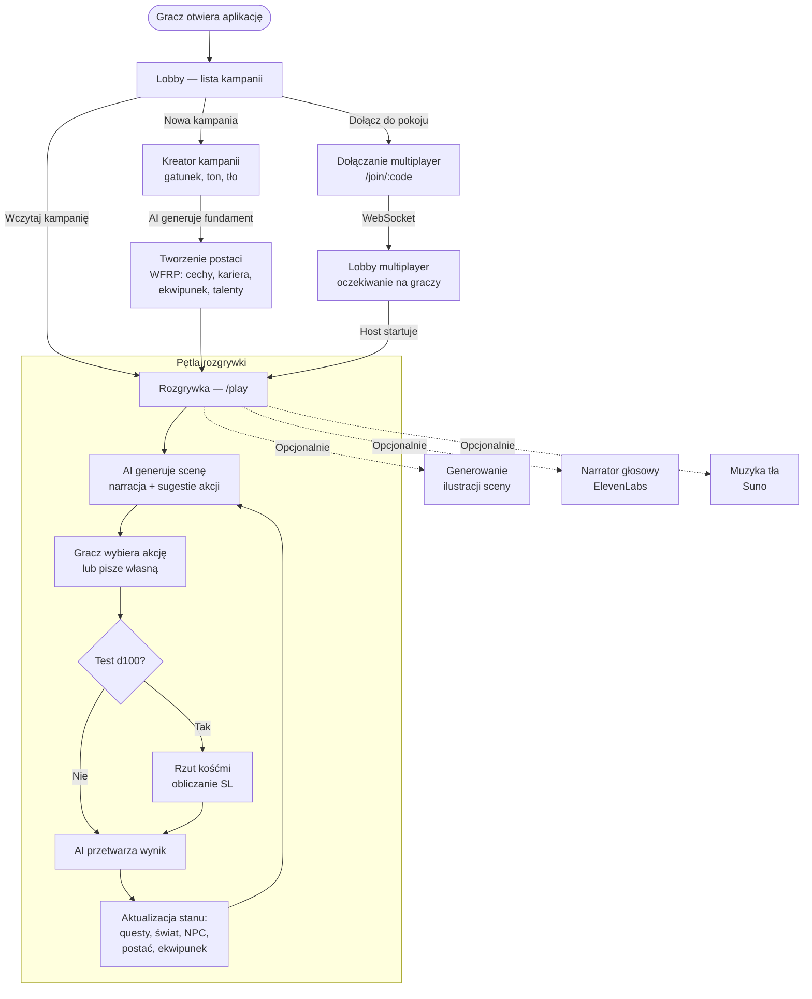
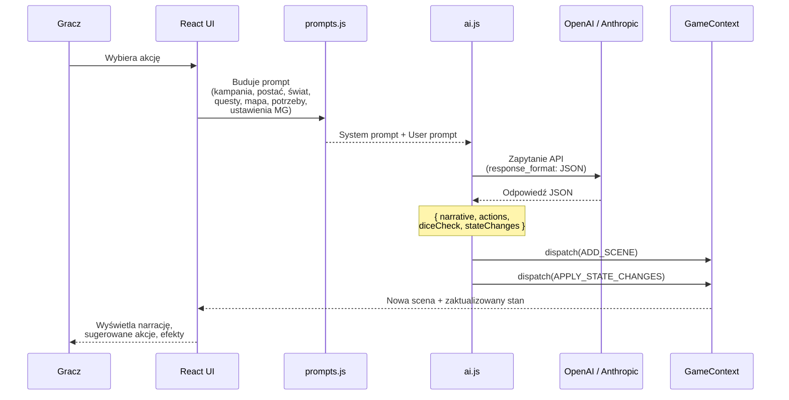
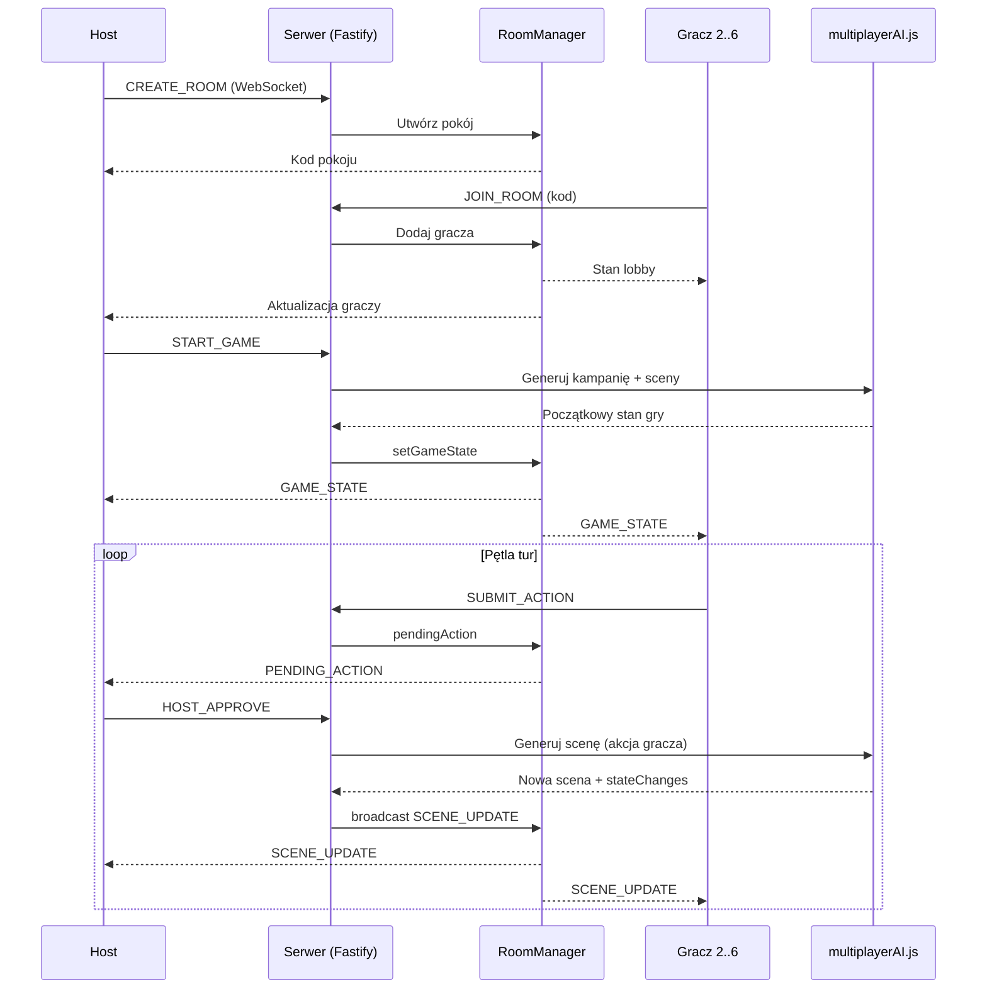

# RPGon — AI-Narrated Tabletop RPG

RPGon to przeglądarkowa gra RPG z narratorem AI, inspirowana mechanikami **Warhammer Fantasy Roleplay** (WFRP). Mistrz Gry sterowany przez LLM prowadzi fabułę, rozstrzyga testy d100, zarządza questami i światem — w trybie solo lub multiplayer do 6 graczy.

## Spis treści

- [Architektura](#architektura)
- [Przepływ gry](#przepływ-gry)
- [Integracja AI](#integracja-ai)
- [Multiplayer](#multiplayer)
- [Funkcjonalności](#funkcjonalności)
- [Stos technologiczny](#stos-technologiczny)
- [Struktura projektu](#struktura-projektu)
- [Uruchomienie](#uruchomienie)

---

## Architektura

```mermaid
graph TB
    subgraph Frontend ["Frontend (React + Vite)"]
        UI[Interfejs gracza]
        GC[GameContext<br/>useReducer]
        MC[MultiplayerContext]
        SC[SettingsContext]
        AI_SVC[ai.js — AI Service]
        WS[websocket.js]
        PROMPTS[prompts.js<br/>Context Manager]
    end

    subgraph Backend ["Backend (Fastify)"]
        SERVER[server.js]
        AUTH[/auth]
        PROXY["/proxy/*<br/>(OpenAI, Anthropic,<br/>ElevenLabs, Stability, Suno)"]
        MP_ROUTE[/multiplayer<br/>WebSocket]
        CAMP[/campaigns]
        ROOM[RoomManager]
        MP_AI[multiplayerAI.js]
    end

    subgraph External ["Usługi zewnętrzne"]
        OPENAI[OpenAI<br/>GPT-4o]
        ANTHROPIC[Anthropic<br/>Claude]
        ELEVEN[ElevenLabs<br/>TTS]
        STABILITY[Stability AI<br/>Obrazy]
        SUNO[Suno<br/>Muzyka]
    end

    subgraph Storage ["Przechowywanie danych"]
        MONGO[(MongoDB<br/>via Prisma)]
        LOCAL[localStorage<br/>kampanie solo]
    end

    UI --> GC
    UI --> MC
    UI --> SC
    GC --> AI_SVC
    AI_SVC --> PROMPTS
    AI_SVC -->|klucze lokalne| OPENAI
    AI_SVC -->|klucze lokalne| ANTHROPIC
    AI_SVC -->|przez proxy| PROXY
    PROXY --> OPENAI
    PROXY --> ANTHROPIC
    PROXY --> ELEVEN
    PROXY --> STABILITY
    PROXY --> SUNO
    WS <-->|WebSocket| MP_ROUTE
    MC --> WS
    MP_ROUTE --> ROOM
    ROOM --> MP_AI
    MP_AI --> OPENAI
    MP_AI --> ANTHROPIC
    SERVER --> AUTH
    SERVER --> PROXY
    SERVER --> MP_ROUTE
    SERVER --> CAMP
    AUTH --> MONGO
    CAMP --> MONGO
    GC -->|zapis/odczyt| LOCAL
```

---

## Przepływ gry



---

## Integracja AI



### Co zawiera odpowiedź AI

| Pole | Opis |
|------|------|
| `narrative` | Tekst narracji opisujący scenę |
| `actions` | Lista sugerowanych akcji do wyboru |
| `diceCheck` | Opcjonalny test d100 — cecha, trudność, kontekst |
| `stateChanges` | Zmiany stanu gry: nowe questy, fakty o świecie, zmiany NPC, ekwipunek, rany, pieniądze |

### Typy zapytań AI

- **`generateCampaign`** — tworzenie fundamentu kampanii (gatunek, świat, antagonista, questy startowe)
- **`generateScene`** — główna pętla gry: narracja + rozstrzygnięcie akcji
- **`generateRecap`** — podsumowanie dotychczasowej fabuły
- **`compressScenes`** — kompresja starych scen (oszczędność tokenów)
- **`verifyObjective`** — weryfikacja wykonania celu questa

---

## Multiplayer



### Cykl życia pokoju

1. Host tworzy pokój lub konwertuje kampanię solo (`CONVERT_TO_MULTIPLAYER`)
2. Gracze dołączają po kodzie — lobby aktualizuje się w czasie rzeczywistym
3. Gracz może dołączyć w trakcie gry — AI generuje mu postać wpasowaną w fabułę
4. Akcje graczy wymagają zatwierdzenia hosta
5. Pokoje bez aktywności są automatycznie czyszczone (TTL)
6. Stan multiplayer jest przechowywany w pamięci serwera (nie w DB)

---

## Funkcjonalności

### Rozgrywka
- Narracja prowadzona przez AI (GPT-4o / Claude)
- System d100 z poziomami sukcesu (SL) i momentum
- Questy z celami, śledzenie postępu, weryfikacja AI
- Mapa świata z NPC i lokacjami
- System potrzeb postaci (głód, zmęczenie itp.)
- Ilustracje scen (Stability AI)
- Narrator głosowy (ElevenLabs TTS)
- Muzyka tła generowana przez AI (Suno)
- Efekty wizualne (pogoda, mgła, cząsteczki, przejścia)

### Postać (WFRP)
- Cechy: WW, US, S, Wt, I, Zw, Zr, Int, SW, Ogd
- Kariery i tiry (1–4)
- Umiejętności i talenty
- Ekwipunek i pieniądze (GC/SS/CP)
- Punkty losu/fortuny, determinacji/hart ducha
- Panel rozwoju postaci

### Multiplayer
- Do 6 graczy w pokoju
- System zatwierdzania akcji przez hosta
- Dołączanie w trakcie rozgrywki
- Konwersja kampanii solo → multiplayer
- Akcje solo z cooldownem

### Zarządzanie
- Zapis/wczytywanie kampanii (lokalnie i na serwerze)
- Eksport logów rozgrywki
- Ustawienia Mistrza Gry (trudność, styl narracji, częstotliwość testów)
- Śledzenie kosztów API
- Dwujęzyczność: polski i angielski

---

## Stos technologiczny

| Warstwa | Technologie |
|---------|-------------|
| **Frontend** | React 18, Vite 6, React Router 6, Tailwind CSS 3, i18next |
| **Backend** | Fastify 5, WebSocket, JWT, Prisma |
| **Baza danych** | MongoDB |
| **AI** | OpenAI (GPT-4o), Anthropic (Claude) |
| **Media** | ElevenLabs (TTS), Stability AI (obrazy), Suno (muzyka) |
| **Przechowywanie mediów** | Google Cloud Storage / system plików |

---

## Struktura projektu

```
RPGon/
├── src/                          # Frontend
│   ├── App.jsx                   # Routing (/, /create, /play, /join/:code)
│   ├── main.jsx                  # Providery kontekstów
│   ├── components/
│   │   ├── gameplay/             # ScenePanel, ActionPanel, ChatPanel, MapCanvas
│   │   ├── character/            # CharacterSheet, QuestLog, Inventory, Advancement
│   │   ├── lobby/                # LobbyPage, CampaignCard
│   │   ├── creator/              # CampaignCreatorPage
│   │   ├── multiplayer/          # PlayerLobby, JoinRoomPage, PendingActions
│   │   ├── settings/             # DMSettingsPage
│   │   ├── layout/               # Header, Sidebar, Layout, MobileNav
│   │   └── ui/                   # Button, GlassCard, LoadingSpinner, Slider
│   ├── contexts/                 # GameContext, MultiplayerContext, SettingsContext
│   ├── hooks/                    # useAI, useGameState, useNarrator, useMusic
│   ├── services/                 # ai, prompts, websocket, apiClient, storage
│   ├── effects/                  # EffectEngine, warstwy wizualne
│   ├── data/                     # wfrp.js — tabele i reguły WFRP
│   └── locales/                  # en.json, pl.json
├── backend/                      # Backend
│   ├── prisma/schema.prisma      # Modele: User, Campaign, Character, MediaAsset
│   └── src/
│       ├── server.js             # Punkt wejścia Fastify
│       ├── routes/               # auth, campaigns, characters, media, multiplayer
│       │   └── proxy/            # openai, anthropic, elevenlabs, stability, suno
│       └── services/             # roomManager, multiplayerAI, mediaStore
├── package.json
└── vite.config.js
```

---

## Uruchomienie

### Wymagania
- Node.js 18+
- MongoDB
- Klucze API: OpenAI lub Anthropic (wymagane), ElevenLabs / Stability / Suno (opcjonalne)

### Instalacja

```bash
# Instalacja zależności frontend + backend
npm install
cd backend && npm install

# Konfiguracja backendu
cp backend/.env.example backend/.env
# Uzupełnij zmienne w backend/.env

# Wygeneruj klienta Prisma
cd backend && npx prisma generate

# Uruchom (frontend + backend jednocześnie)
cd .. && npm run dev
```

Frontend uruchomi się na `http://localhost:5173`, backend na `http://localhost:3001`.

### Tryb bez backendu

Gra może działać w trybie solo bez backendu — wystarczy podać klucze API w ustawieniach aplikacji. Backend jest potrzebny do:
- Multiplayer (WebSocket)
- Proxy API (klucze po stronie serwera)
- Persystencji kampanii i postaci w MongoDB
- Generowania i przechowywania mediów
