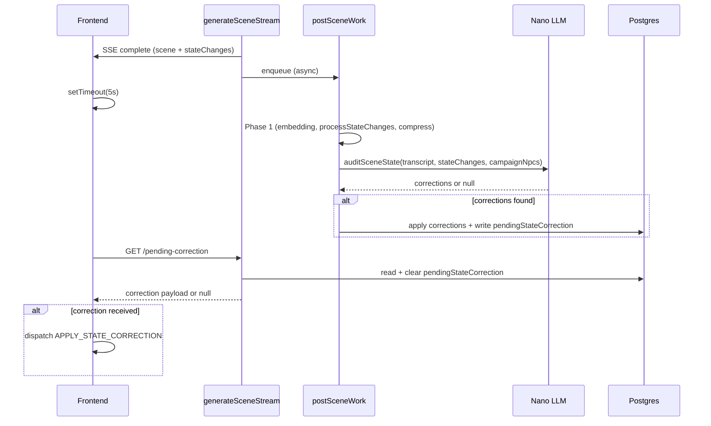

# Post-scene nano auditor — walidacja lokacji i NPC

## Problem

Premium LLM czasem emituje `stateChanges` niespójne z narracją:
- Zmienia lokację choć narracja opisuje że gracz zostaje w miejscu
- NPCe mają błędny attitude/alive/disposition względem tego co mówią/robią w narracji
- NPCe z narracji brakuje w `stateChanges.npcs[]` (lub odwrotnie — jest NPC którego nie ma w scenie)

Istniejący `locationSanityCheck.js` łapie tylko proste heurystyki (brak movement cue, flip A→B→A). Nie czyta narracji i nie sprawdza NPC.

## Architektura



## Backend

### 1. Nowy plik: `backend/src/services/sceneGenerator/sceneStateAuditor.js`

Funkcja `auditSceneState({ sceneTranscript, stateChanges, playerAction, currentLocationName, campaignNpcs, provider, timeoutMs })`:

- Wywołuje `callNano` z promptem który dostaje:
  - Scene transcript (joined dialogueSegments)
  - Player action
  - `stateChanges.currentLocation` (co AI emitowało)
  - `currentLocationName` (lokacja PRZED sceną)
  - `stateChanges.npcs[]` (emitowane zmiany NPC)
  - Lista istniejących `CampaignNPC` z ich stanem (name, attitude, alive, lastLocation)

- Nano odpowiada JSON:
```json
{
  "locationOk": true,
  "correctedLocation": null,
  "locationReason": null,
  "npcCorrections": []
}
```

- Każda `npcCorrection`: `{ name, field, correctedValue, reason }`
- Pola korygowalne: `attitude`, `alive`, `disposition`, `lastLocation`
- Zod walidacja odpowiedzi; jeśli parsowanie się nie uda → return null (non-fatal)

Kluczowe: prompt musi być **krótki** (nano ma limit). Transcript skracamy do ~1500 znaków (ostatnie segmenty). NPC lista max 10 (obecni w scenie + top interacted).

### 2. Integracja w `postSceneWork.js`

Po Phase 1 (processStateChanges + compress), PRZED quest progress check:

```javascript
// Phase 1.5: Scene state audit — nano verifies location + NPC consistency
const auditResult = await auditSceneState({
  sceneTranscript,
  stateChanges,
  playerAction,
  currentLocationName: prevLoc,
  campaignNpcs,
  provider,
  timeoutMs: llmNanoTimeoutMs,
});
if (auditResult?.corrections) {
  await applyAndPushCorrections(campaignId, sceneId, auditResult.corrections);
}
```

`applyAndPushCorrections`:
- Jeśli `correctedLocation` !== null: update `Campaign.currentLocation*` (przez `resolveLocationByName`)
- Jeśli `npcCorrections[]` niepuste: update każdego `CampaignNPC` (attitude/alive/disposition)
- Write correction payload to `Campaign.pendingStateCorrection` (JSONB) — FE odbierze

### 3. Schema: nowe pole w `Campaign`

W `backend/prisma/schema.prisma`, model `Campaign`:

```prisma
pendingStateCorrection Json?
```

Migracja: `prisma migrate dev --name add-pending-state-correction`

### 4. Nowy endpoint: `GET /v1/campaigns/:id/pending-correction`

W `backend/src/routes/campaigns/crud.js` (lub nowy plik `corrections.js` w barrel):

- Authenticated, owner-only
- Read `campaign.pendingStateCorrection`
- If not null: return it AND clear (set to null) in one operation
- If null: return `{ correction: null }`

## Frontend

### 5. Hook: `usePendingCorrection` lub inline w `useSceneGeneration`

W `src/hooks/sceneGeneration/useSceneGeneration.js`:

- Po otrzymaniu `complete` event (solo) — `setTimeout(5000)` → `GET /v1/campaigns/:id/pending-correction`
- W multiplayer: w `src/contexts/multiplayer/useMpWsSubscription.js` po otrzymaniu scene via WS — ten sam `setTimeout(5000)` + fetch

Jeśli correction != null → dispatch `APPLY_STATE_CORRECTION`

### 6. Handler: `APPLY_STATE_CORRECTION` w store

W `src/stores/handlers/applyStateChangesHandler/`:

- Nowy handler (lub w `sceneFlow.js`) który:
  - Updatuje `state.world.currentLocation` jeśli `correctedLocation` podane
  - Updatuje NPC w `state.npcs[]` jeśli `npcCorrections` podane (attitude, alive, disposition)
  - Loguje korektę do devEventLog (widoczne w DevEventLogPanel)

## Kosztorys i ryzyka

- **Latencja**: 0 dodanych do sceny (async). Nano call ~1-2s, razem z DB ~2-3s. FE odpytuje po 5s.
- **Koszt**: 1 dodatkowy nano call per scene (~0.001 USD). Prompt ~500-800 tokenów, odpowiedź ~100-200.
- **Ryzyko**: nano może sam halucynować korekty. Mitygacja: prompt instruuje "jeśli nie jesteś pewien, zwróć locationOk:true i puste npcCorrections". Dodatkowo: logujemy każdą korektę do audit trail.
- **Timing**: FE poll po 5s może być za wcześnie jeśli Cloud Tasks jest wolny. Rozwiązanie: retry po kolejnych 5s jeśli `pendingStateCorrection` jest null a scena była <10s temu (max 2 retry).

## Pliki do zmiany / utworzenia

| Plik | Operacja |
|---|---|
| `backend/prisma/schema.prisma` | Dodać `pendingStateCorrection Json?` do `Campaign` |
| `backend/src/services/sceneGenerator/sceneStateAuditor.js` | **NOWY** — nano prompt + Zod + apply logic |
| `backend/src/services/postSceneWork.js` | Integracja auditora po Phase 1 |
| `backend/src/routes/campaigns/crud.js` | Nowy endpoint GET pending-correction |
| `src/hooks/sceneGeneration/useSceneGeneration.js` | Delayed fetch po complete |
| `src/contexts/multiplayer/useMpWsSubscription.js` | Delayed fetch po scene via WS |
| `src/stores/handlers/applyStateChangesHandler/` | Handler APPLY_STATE_CORRECTION |
