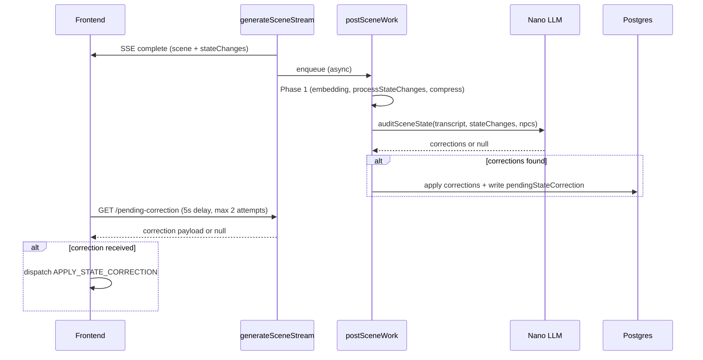

# Post-scene nano auditor — location + NPC state verification

**Status: IMPLEMENTED** (solo flow; MP polling deferred)

## Problem

Premium LLM sometimes emits `stateChanges` inconsistent with its own narration:
- Changes location even though narration describes the party staying put
- NPCs have wrong attitude/alive/disposition relative to what happens in the transcript
- NPCs mentioned in narration are missing from `stateChanges.npcs[]` (or vice versa)

The inline `locationSanityCheck.js` (step 5a2 in `generateSceneStream`) catches only two heuristic patterns (missing movement cue, A→B→A flip). It never reads the transcript and cannot catch subtler issues.

## Architecture

Two-layer defense:

1. **Inline heuristic** (`locationSanityCheck.js` in `generateSceneStream`, step 5a2) — zero-cost, catches the most egregious teleport hallucinations *before* the scene reaches FE. Stays as-is.

2. **Post-scene nano auditor** (`sceneStateAuditor.js` in `postSceneWork`, Phase 1.5) — reads the actual transcript, calls nano to verify location + NPC consistency, writes corrections to DB, FE polls and applies.

## Backend

### `backend/src/services/sceneGenerator/sceneStateAuditor.js`

**`auditSceneState()`** — calls `callNano` with:
- Last ~1500 chars of transcript (dialogue + narration)
- Player action text
- `stateChanges.currentLocation` (what AI emitted)
- `currentLocationName` (location BEFORE the scene)
- `stateChanges.npcs[]` (emitted NPC changes)
- Top 10 alive `CampaignNPC` rows (name, attitude, alive, disposition)

Nano responds with JSON: `{ locationOk, correctedLocation, locationReason, npcCorrections[] }`.
- `npcCorrection`: `{ name, field, correctedValue, reason }`
- Correctable fields: `attitude`, `alive`, `disposition`
- Parse failure returns null (non-fatal)

**`applyAndPushCorrections()`** — applies corrections to DB:
- Location: resolves via `resolveLocationByName`, updates `Campaign.currentLocation*`
- NPCs: updates `CampaignNPC` rows for each correction
- Writes the full correction payload to `Campaign.pendingStateCorrection` (one-shot JSONB, cleared on read)

### Integration in `postSceneWork.js`

Phase 1.5 — after Phase 1 (`Promise.allSettled`) and quest XP/money, before `_locationSnapshot` write. Loads top-10 alive CampaignNPCs, calls `auditSceneState`, applies if corrections found. Non-fatal on failure.

### Prisma: `Campaign.pendingStateCorrection`

`Json?` column — one-shot JSONB payload, same pattern as `pendingSlip` / `pendingProvidence`. Written by auditor, read+cleared by the polling endpoint.

### Endpoint: `GET /v1/campaigns/:id/pending-correction`

In `backend/src/routes/campaigns/corrections.js`:
- Authenticated, owner-only
- Reads `campaign.pendingStateCorrection`
- If non-null: returns it AND clears to null atomically
- If null: returns `{ correction: null }`

## Frontend

### Polling (`useSceneGeneration.js`)

After scene complete + dispatch + autoSave, fires `pollPendingCorrection()` — fire-and-forget:
- 5s delay, then `GET /campaigns/:id/pending-correction`
- If null and attempts < 2, retry after another 5s
- If correction received, `dispatch({ type: 'APPLY_STATE_CORRECTION', payload })` + devLog

### Handler (`stateCorrectionHandler.js`)

Registered in `gameReducer.js` as `APPLY_STATE_CORRECTION`:
- Updates `state.world.currentLocation` if `correction.location` present
- Updates matching NPCs in `state.npcs[]` (attitude, alive, disposition)
- Emits to devLog (`category: 'audit'`) for visibility in DevEventLogPanel

### Multiplayer

MP polling deferred. The auditor runs on the host's backend (postSceneWork fires for MP scenes too), so `pendingStateCorrection` is written. Guests don't have solo-campaign polling — would need a WS event or MP-specific poll.

## Cost and risks

- **Latency**: 0ms added to scene delivery (fully async). Nano call ~1-2s, DB writes ~100ms. FE polls at 5s.
- **Cost**: 1 nano call per scene (~0.001 USD). Prompt ~500-800 tokens, response ~100-200.
- **Risk**: nano may hallucinate corrections. Mitigated by prompt instruction ("if unsure, return locationOk:true and empty npcCorrections") + all corrections logged to audit trail.
- **Timing**: If Cloud Tasks is slow (>10s), correction may be missed by both FE poll attempts. Acceptable — next scene load would also pick it up.

## Files

| File | Role |
|---|---|
| `backend/prisma/schema.prisma` | `Campaign.pendingStateCorrection Json?` |
| `backend/src/services/sceneGenerator/sceneStateAuditor.js` | Nano prompt + apply logic |
| `backend/src/services/postSceneWork.js` | Phase 1.5 integration |
| `backend/src/routes/campaigns/corrections.js` | Polling endpoint |
| `backend/src/routes/campaigns.js` | Barrel registration |
| `src/hooks/sceneGeneration/useSceneGeneration.js` | `pollPendingCorrection` |
| `src/stores/handlers/stateCorrectionHandler.js` | `APPLY_STATE_CORRECTION` handler |
| `src/stores/gameReducer.js` | Handler registration |
| `backend/src/services/sceneGenerator/locationSanityCheck.js` | Dead `checkGraphReachability` removed |
